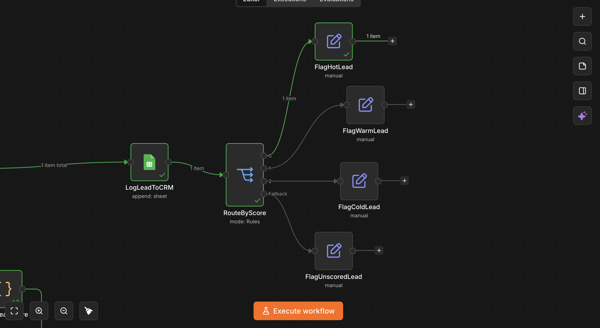
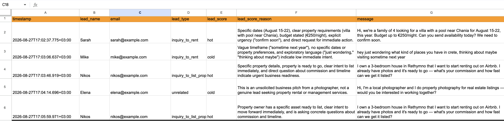

# AI-Powered Lead Scoring & Routing System
### An automation case study — n8n + Claude (Anthropic API)

---

## The Problem

Property rental and management businesses receive inbound leads through contact forms — some are ready to book or list a property today, others are casually browsing months out, and some aren't genuine leads at all (partnership pitches, unrelated outreach). Treated identically, a hot lead with a two-week booking window can sit in the same queue as a vague "just looking" message — and by the time someone gets to it, the opportunity may be gone.

This project builds an automated intake layer that classifies each incoming lead, scores it by genuine urgency and intent (not just keywords), logs every lead to a permanent CRM record, and routes it to the right follow-up priority — so a business can act on its hottest leads first without manually triaging an inbox.

---

## Architecture

```
LeadSubmitted (webhook)
        │
        ▼
ClassifyLeadType (Claude) ──► SetLeadType
lead_type = inquiry_to_rent | inquiry_to_list_property | unrelated
        │
        ▼
MergeLeadWithClassification
        │
   ┌────┴────┐
   ▼         ▼
ScoreLeadQuality (Claude)   (original lead data)
   │
   ▼
ParseLeadScore
lead_score = hot | warm | cold, with a one-sentence reason
        │
        ▼
MergeLeadWithScore
        │
        ▼
LogLeadToCRM  (every lead, regardless of score)
        │
        ▼
RouteByScore
   │      │      │        │
   ▼      ▼      ▼        ▼
 hot    warm   cold    (unscored/fallback)
   │      │      │        │
   ▼      ▼      ▼        ▼
"Contact  "Contact  "Add to    "Needs manual
within    within    nurture    review"
1 hour"   24 hours" list"
```

**Key design decisions:**

- **Classification and scoring are two separate AI steps, not one.** Deciding *what kind* of lead this is (rental inquiry vs. property listing vs. not a lead at all) and deciding *how urgent* it is are genuinely different judgment calls. Splitting them keeps each prompt focused and makes each decision easier to verify independently.
- **Scoring is a judgment call with reasoning, not a fixed label.** Unlike a simple category, the scoring step asks the model to weigh specific signals (dates, urgency, specificity, intent) and explain its reasoning in one sentence. That reasoning is stored alongside the score, so a human reviewing the CRM can see *why* a lead was scored the way it was, not just the label.
- **Every lead is logged before it's routed.** Regardless of score, every lead lands in a permanent CRM record first. Routing only decides what happens *next* — it never determines whether a lead gets recorded at all.
- **An unscored lead still gets handled.** If the scoring step ever fails to produce a valid `hot`/`warm`/`cold` value, the routing step has an explicit fallback branch that flags the lead for manual review, rather than letting it silently disappear.

---

## What It Demonstrates



- **Genuine judgment, not keyword matching.** A message from a local photographer pitching a business partnership was correctly classified as `unrelated` and scored `cold`, with the reasoning explicitly identifying it as "an unsolicited business pitch... not a genuine lead" — a distinction a simple keyword or category rule would likely miss, since the message itself doesn't contain any obviously negative language.
- **Consistent handling across genuinely different lead types.** A rental inquiry and a property-listing inquiry — two different `lead_type` values representing opposite sides of the same business (guests vs. property owners) — were both correctly classified and both scored `hot` when they showed clear, specific intent, confirming the scoring logic generalizes across lead type rather than being tuned to one scenario.
- **Nothing is dropped.** Every tested lead, regardless of type or score, produced a permanent CRM record before any routing decision was made.



---

## Real Issues Encountered and Fixed

1. **Data loss across the AI classification and scoring steps.** Each Anthropic ("Message a model") node only returns its own response, dropping everything that arrived before it — the same underlying n8n behavior encountered in an earlier project, but it appears anywhere an AI call sits in the middle of a chain. Fixed twice here: once with `MergeLeadWithClassification` (rejoining the original webhook data with the classification result) and again with `MergeLeadWithScore` (rejoining that combined data with the parsed score).
2. **A Merge input silently wired to the wrong upstream node.** `MergeLeadWithScore`'s second input was connected directly to `ScoreLeadQuality` (the raw AI response) instead of `ParseLeadScore` (the node that actually extracts the clean `lead_score`/`lead_score_reason` fields). Both nodes' outputs contain a `content` field, so the mistake wasn't obvious from the data shape alone — it only became clear by explicitly tracing the connection back to its source node rather than assuming it pointed where intended.
3. **Structured multi-field AI output required explicit parsing.** Unlike a single-word classification, the scoring prompt returns two pieces of information (a score and a reason) in one text block. A dedicated parsing step splits the raw response into two clean fields using simple line-matching, rather than trying to extract structured data with a single expression.

---

## Honest Limitations

- **The knowledge behind scoring is entirely prompt-based**, not calibrated against real historical conversion data. A production version would ideally validate and tune the scoring criteria against which leads actually converted, rather than relying on the model's judgment alone.
- **Routing produces a priority label, not a real action.** This version tags each lead with a follow-up priority; a production system would connect that to an actual notification (Slack, SMS) or CRM assignment rather than just a log entry.
- **Two lead types only.** A real business likely has a wider variety of inbound message types (support questions, media inquiries, vendor pitches); the `unrelated` category and fallback branch make the system safe against anything unexpected, but a production version would likely expand the category set based on real message volume.
- **Single language**, matching the constraint noted in the companion project below.

---

## Stack

n8n (workflow orchestration) · Anthropic Claude API (classification, scoring, and reasoning) · Google Sheets (CRM logging)

---

*A related project, an AI-powered guest inquiry triage system with retrieval-based grounded replies, is available here: https://github.com/iason-a/ai-guest-inquiry-triage*
